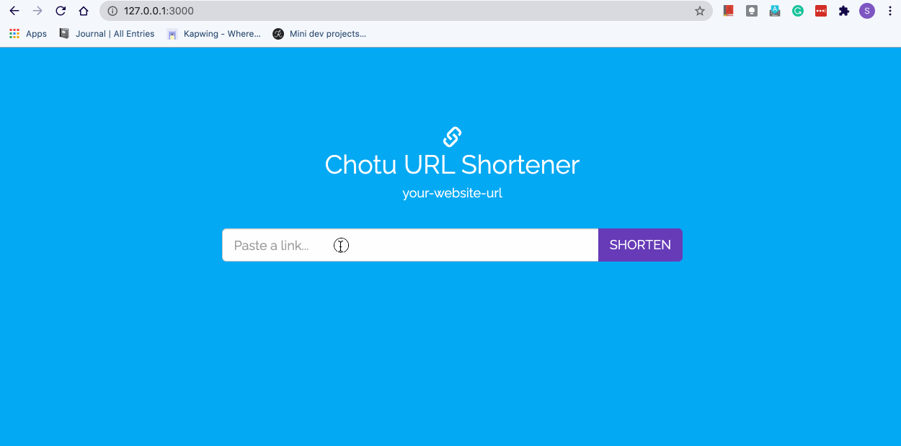

# Chotu URL
A simple custom URL shortener for easy sharing



## Start Project

### Install Dependencies
```bash
$ npm install
```
### Start Server
```bash
$ npm start
```

### Start Server In Debug mode
```bash
$ npm run debug
```

## Run Test Cases
```bash
$ npm run test
```

## Build & Run Docker Image
To build and run the docker images run the following command.
```bash
$ docker-compose up
```